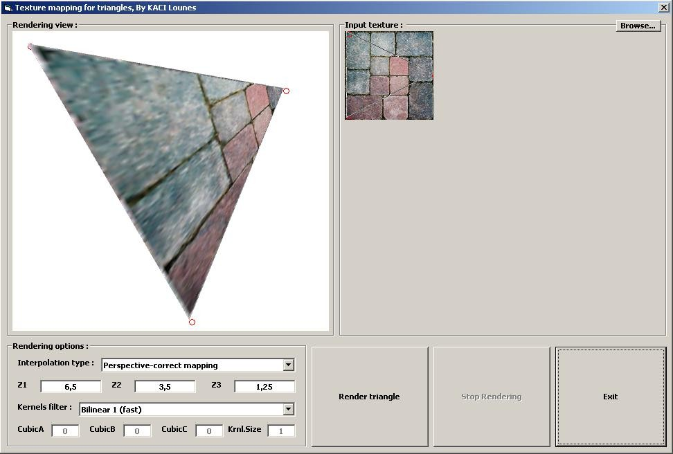



## Texture mapping for triangles, Pure VB, KACI Lounes

### Description

Great news for devloppers in 3D, Texture mapping for triangles, including Affine &amp; Perspective-correct, Filtering (Bilinear,Bell,Gaussian...etc)

all in Pure VB !!
 
### More Info
 

             |
---                |---
**Submitted On**   |2000-07-22 17:50:26
**By**             |[KACI   Lounes](https://github.com/Planet-Source-Code/PSCIndex/blob/master/ByAuthor/kaci-lounes.md)
**Level**          |Advanced
**User Rating**    |4.8 (19 globes from 4 users)
**Compatibility**  |VB 6\.0
**Category**       |[Graphics](https://github.com/Planet-Source-Code/PSCIndex/blob/master/ByCategory/graphics__1-46.md)
**World**          |[Visual Basic](https://github.com/Planet-Source-Code/PSCIndex/blob/master/ByWorld/visual-basic.md)
**Archive File**   |[Texture\_ma199823622006\.zip](https://github.com/Planet-Source-Code/kaci-lounes-texture-mapping-for-triangles-pure-vb-kaci-lounes__1-65547/archive/master.zip)

